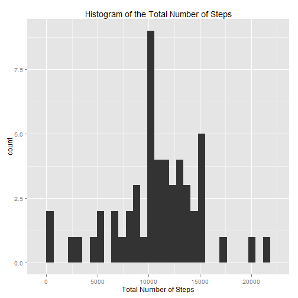
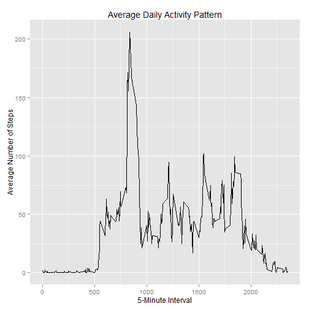
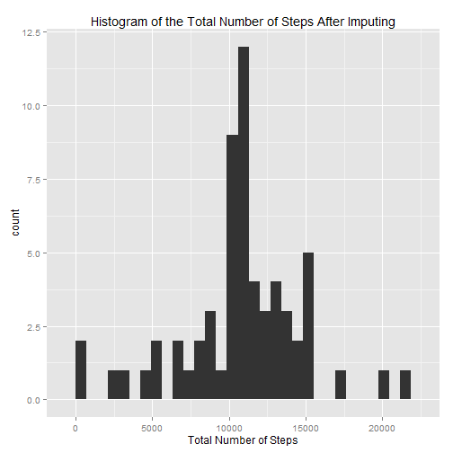

#Reproducible Research: Peer Assessment 1

This is an R Markdown document.The purpose of this document is to analyze the data within the Activity monitoring dataset provided. The first step is to load the data:


```r
act <- read.csv("activity.csv")
```

Next, we want to load in our graphing tool - ggplot:


```r
library(ggplot2)
```

## What is mean total number of steps taken per day?

The first task is to create a histogram showing the total number of steps taken each day. For this part we can omit NA values and sum the steps variable by the date variable using the aggregate function. Next we will use ggplot with the geom_histogram function to create the histogram:


```r
sumsteps <- aggregate(steps ~ date, data = act, FUN = sum, na.rm = TRUE)
g1 <- ggplot(sumsteps, aes(x=sumsteps$steps)) + geom_histogram()
g1 + labs(title = "Histogram of the Total Number of Steps", x = "Total Number of Steps")
```

 


```r
mean1 <- format(round(mean(sumsteps$steps),2), nsmall = 2)
median1 <- format(round(median(sumsteps$steps),2), nsmall = 2)
```

The mean of the total number of steps is 10766.19. The median of the total number of steps is 10765.00

##What is the average daily activity pattern?

The next task is to make a time series plot of the 5-minute interval and the average number of steps taken, averaged across all days.
First we will average the number of steps by interval:


```r
avgsteps <- aggregate(steps ~ interval, data = act, FUN = mean, na.rm = TRUE)
```

Next, we will display the results in a time series chart using ggplot:

```r
g2 <- ggplot(avgsteps,aes(x=avgsteps$interval, y=avgsteps$steps))
g2 + geom_line() + labs(title = "Average Daily Activity Pattern", x = "5-Minute Interval", y = "Average Number of Steps")
```

 

To find out the interval that contains the max of the average number of steps we use which.max and subset:

```r
maxint <- which.max(avgsteps$steps)
maxinterval <- avgsteps[maxint,]
```
With this we see that the 5-minute interval 835 contains the max average number of steps. 
The max average number of steps is equal to 206.1698113.

##Imputing Missing Values
The next task is to deal with questions regarding the NA values in the data. First we will calculate the number of missing values in the dataset using is.na and sum:

```r
actsumna <- sum(is.na(act))
```
Using this formula we see that the number of missing values is 2304.

Next we will fill in the NA values with the averages of the steps by the intervals. I do this by joining the original data (act) with the average steps by interval data calculated previously (avgsteps). After merging we then replace the na's with the values in the average columns. Finally, we remove the last column to arrive at our new imputed dataset. Below is the code used to implement the imputing strategy:


```r
mergedact <- merge(act, avgsteps, by = "interval")
mergedact$steps.x[is.na(mergedact$steps.x)] <- mergedact$steps.y[is.na(mergedact$steps.x)]
actimputed <- mergedact[,1:3]
```

The new dataset "actimputed" is the same as the old "act" dataset but with the NA values now replaced by the average steps by interval.
We will now sum the steps by day and create a histogram with the new dataset:


```r
sumsteps2 <- aggregate(steps.x ~ date, data = actimputed, FUN = sum)
g3 <- ggplot(sumsteps2, aes(x = steps.x)) + geom_histogram()
g3 + labs(title = "Histogram of the Total Number of Steps After Imputing", x = "Total Number of Steps")
```

 

We will once again calculate the mean and median for the new imputed dataset:


```r
mean2 <- format(round(mean(sumsteps2$steps.x),2), nsmall = 2)
median2 <- format(round(median(sumsteps2$steps.x),2), nsmall = 2)
```

The mean of the total number of steps is 10766.19. The median of the total number of steps is 10766.19

##Differences in Activity Patterns Between Weekdays and Weekends?

Our next task is to see the difference in activities between weekends and weekdays. We will create a new variable containing the values weekend or weekday based on the date variable in the new imputed dataset. To do this first I will create a new column filled with the weekdays using the weekdays function. Next I will replace the weekdays with the value weekday and the weekend days with the value weekend using subsetting.


```r
actimputed$timeofweek <- weekdays(as.Date(actimputed$date))
actimputed$timeofweek[actimputed$timeofweek %in% c("Monday", "Tuesday", "Wednesday", "Thursday", "Friday")] <- "Weekday"
actimputed$timeofweek[actimputed$timeofweek %in% c("Saturday", "Sunday")] <- "Weekend"
```

Next we will use ggplot to show the difference in the average number of steps taken by interval between weekends and weekdays. First we will take the average number of steps by the interval and the new value timeofweek


```r
avgsteps2 <- aggregate(steps.x ~ interval + timeofweek, data = actimputed, FUN = mean)
g4 <- ggplot(avgsteps2, aes(x= interval , y= steps.x))
g4 + geom_line() + facet_grid(timeofweek ~ .) + labs(title = "Average Daily Activity Pattern Split by Weekend and Weekday", x = "5-Minute Interval", y = "Average Number of Steps")
```

 

This concludes the assignment. Thanks for reading!


